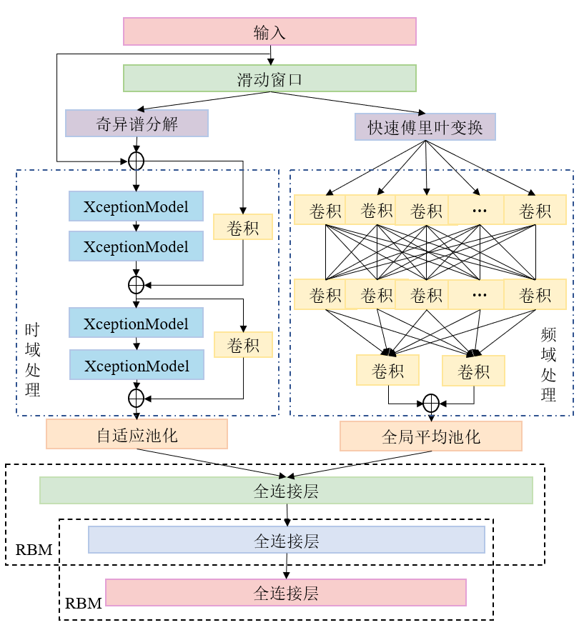
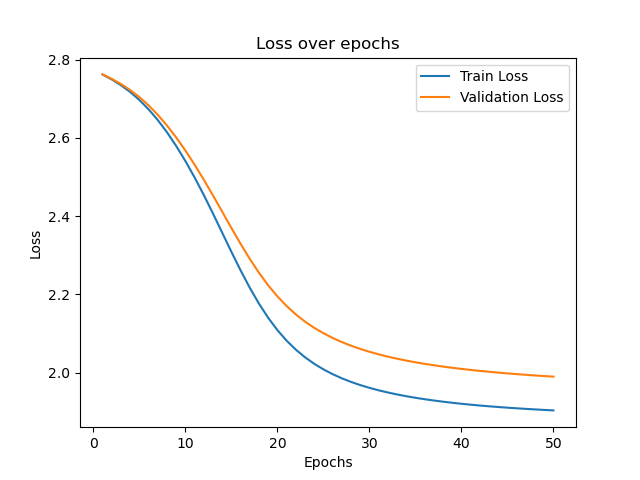
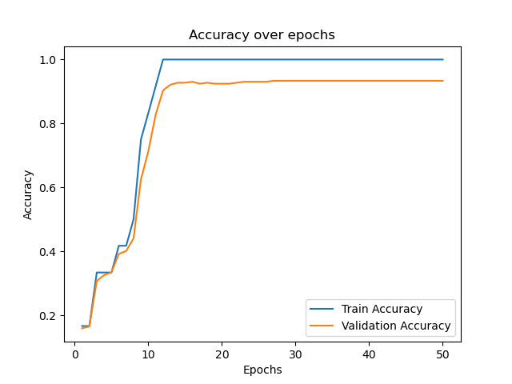

# 原代码重写
## 简介

## 环境

详见

## 效果

## 参考
* [tsai](https://github.com/timeseriesAI/tsai)
* Fawaz, H. I., Lucas, B., Forestier, G., Pelletier, C., Schmidt, D. F., Weber, J. & Petitjean, F. (2019). InceptionTime: Finding AlexNet for Time Series Classification. arXiv preprint arXiv:1909.04939.
* Rahimian E, Zabihi S, Atashzar S F, et al. Xceptiontime: independent time-window xceptiontime architecture for hand gesture classification[C]//ICASSP 2020-2020 IEEE International Conference on Acoustics, Speech and Signal Processing (ICASSP). IEEE, 2020: 1304-1308.
* Tang W, Long G, Liu L, et al. Omni-Scale CNNs: a simple and effective kernel size configuration for time series classification[J]. arXiv preprint arXiv:2002.10061, 2020.

## todo
1. 可视化
2. 参数调优